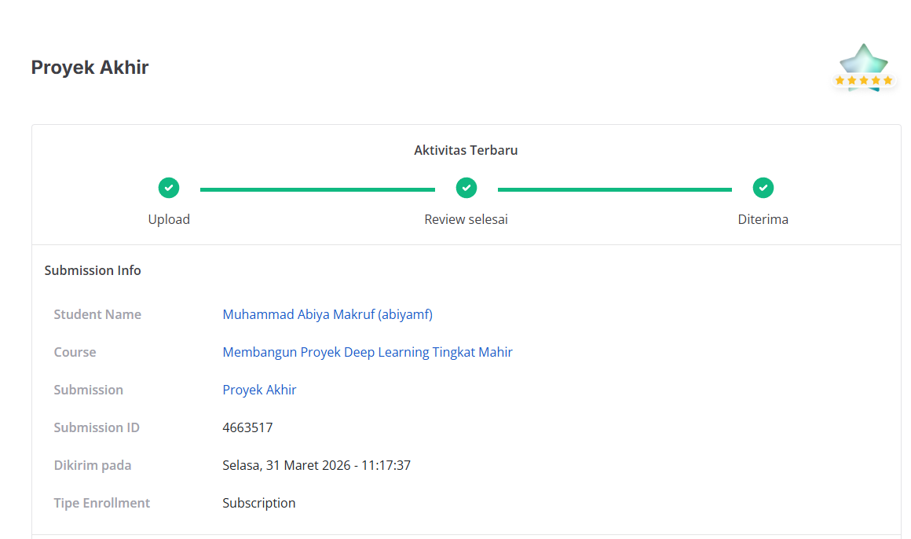

# Proyek Akhir Membangun Proyek Deep Learning Tingkat Mahir

## Penilaian Proyek
Proyek ini berhasil mendapatkan bintang 5/5 pada submission dicoding course Membangun Proyek Deep Learning Tingkat Mahir.



## Ringkasan
Project ini mengerjakan tugas akhir **Multivariate Multi-Horizon Time Series Forecasting** untuk memprediksi nilai penutupan (`Close`) Bitcoin selama **24 langkah ke depan** menggunakan pendekatan deep learning berbasis **LSTM** dan **Seq2Seq LSTM**.

Tujuan utama project:
- membangun pipeline forecasting multivariat yang aman dari data leakage,
- memenuhi seluruh kriteria proyek hingga level advanced,
- membandingkan model baseline LSTM dan model Seq2Seq LSTM kustom,
- melakukan training dan evaluasi dengan pendekatan custom.

## Dataset
Dataset yang digunakan adalah data time series Bitcoin dengan kolom:
- `Date`
- `Close`
- `Volume USDT`
- `RSI`
- `MACD_Hist`
- `ATR`
- `KAMAO`

Target prediksi:
- `Close`

Fitur input model:
- `Close`
- `Volume USDT`
- `RSI`
- `MACD_Hist`
- `ATR`
- `KAMAO`
- `close_roll_mean_24`
- `close_roll_std_24`

Dua fitur terakhir merupakan hasil feature engineering berbasis **rolling statistic**.

## Yang Dikerjakan di Project Ini
Project ini mencakup:

1. **Persiapan dan analisis data**
- membaca dataset time series Bitcoin,
- mengurutkan data secara kronologis,
- membagi data menjadi `train`, `validation`, dan `test`,
- melakukan scaling per kolom hanya pada data train untuk mencegah data leakage,
- membuat heatmap korelasi antar fitur,
- melakukan dekomposisi target `Close`,
- melakukan analisis `ACF` dan `PACF` untuk menentukan `window size`.

2. **Pembuatan dataset supervised**
- membentuk data menjadi format sequence-to-sequence,
- menggunakan horizon prediksi tetap sebanyak `24 step`,
- membangun pipeline input dengan `tf.data.Dataset`.

3. **Pembuatan model**
- **Baseline LSTM** untuk memenuhi baseline forecasting,
- **Seq2Seq LSTM Teacher Forcing** dengan **Functional API**,
- **Seq2Seq LSTM Teacher Forcing** dengan **Model Subclassing**,
- penambahan **Multi-Head Attention** pada model final,
- implementasi custom layer:
  - `CustomDense`
  - `CustomMultiHeadAttention`
  - `CustomLayerNormalization`

4. **Custom training**
- melatih model dengan `tf.GradientTape`,
- menampilkan log training per epoch,
- menggunakan **custom MAE loss**,
- menggunakan **weighted horizon loss** agar horizon yang lebih jauh memiliki bobot error lebih tinggi,
- menggunakan **CustomEarlyStopping**,
- menggunakan **CustomReduceLROnPlateau**.

5. **Evaluasi model**
- evaluasi pada data test dengan metrik utama **MAE**,
- inferensi baseline secara direct multi-step,
- inferensi Seq2Seq secara **autoregressive**,
- visualisasi hasil prediksi dengan line chart,
- pembuatan tabel perbandingan nilai aktual dan prediksi.

6. **Penyimpanan artefak**
- menyimpan model ke format `.keras`,
- menyiapkan `requirements.txt`,
- menyiapkan notebook submission yang berisi seluruh output.

## Struktur Berkas
Struktur project yang diharapkan:

```text
DLTM_Nama-siswa/
├── Abiyamf_Submission_Akhir_DLTM.ipynb
├── model_baseline_LSTM.keras
├── model_seq2seq_LSTM.keras
├── best_model_seq2seq_LSTM.keras
├── requirements.txt
└── README.md
```

Catatan:
- file `best_model_seq2seq_LSTM.keras` bersifat opsional,
- notebook harus dijalankan penuh sebelum dikumpulkan agar output tersimpan.

## Cara Menjalankan
Disarankan menjalankan project ini di **Google Colab GPU**.

Langkah umum:
1. Buka notebook `Abiyamf_Submission_Akhir_DLTM.ipynb`.
2. Jalankan seluruh cell dari atas ke bawah.
3. Pastikan seluruh output muncul tanpa error.
4. Pastikan file model `.keras` berhasil tersimpan.
5. Simpan notebook dalam keadaan sudah ter-run penuh.

## Fokus Penilaian
Project ini disusun untuk memenuhi:
- **Kriteria 1 advanced**
- **Kriteria 2 advanced**
- **Kriteria 3 advanced**

Namun status akhir tetap bergantung pada:
- notebook berhasil dijalankan penuh,
- output tersimpan,
- model `.keras` berhasil dibuat,
- performa model Seq2Seq pada data test memenuhi target evaluasi.

## Teknologi yang Digunakan
- Python
- TensorFlow / Keras
- NumPy
- Pandas
- Matplotlib
- Seaborn
- Scikit-learn
- Statsmodels
